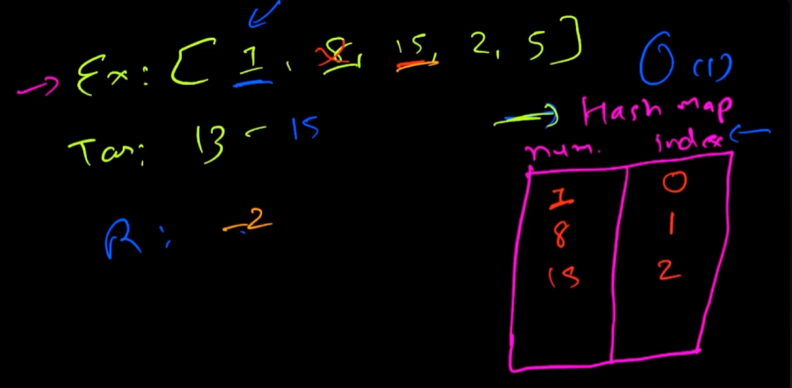
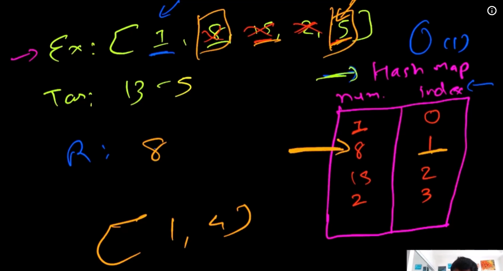

brute force
subtract i from target and check remainder in array
complexity n^2

better approach
sort array (nlogn) merge sort
subtract i from target and check remainder in sorted array binary search log n time
complexity n log n

optimal solution
subtract i from target check remainder exists in hashmap or not

